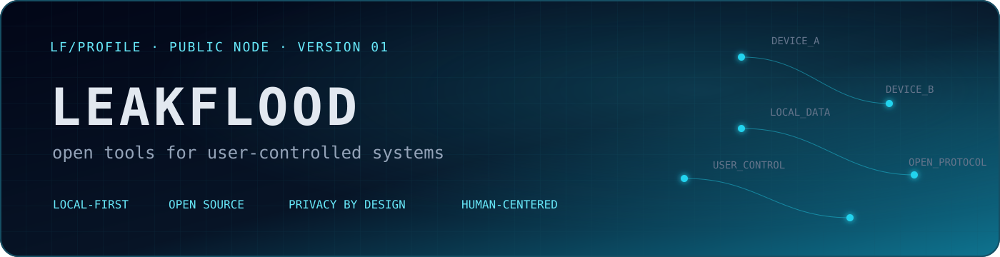

### Building useful software without taking control away from the user.

A secondary space for selected projects, experiments and intentionally published work — not my primary GitHub account.

## Core principles

<table>
<tr>
<td width="50%" valign="top">

◈ **Local by default**  
Data should stay close to the person who created it.

</td>
<td width="50%" valign="top">

◇ **Designed for people**  
Complex systems should create simple, clear experiences.

</td>
</tr>
<tr>
<td width="50%" valign="top">

◎ **Open foundations**  
Software should remain inspectable, portable and replaceable.

</td>
<td width="50%" valign="top">

◉ **Built to evolve**  
Scalability should preserve clarity.

</td>
</tr>
</table>

## Current explorations

<strong>Direct Exchange</strong> — private file transfer without a permanent intermediary

 

- Peer-to-peer exchange when possible
- End-to-end encryption by design
- No lasting central copy of the payload
- Ephemeral by default

`P2P` `E2EE`

PRIVATE EXPLORATION

<strong>Data Passport</strong> — a clear, open description of how software handles data

 

- Make data practices readable to people
- Prefer open, portable descriptions
- Transparency as part of the product surface
- Useful before it becomes ceremonial

`privacy` `transparency`

CONCEPT

<strong>Local Migration</strong> — turn closed-platform exports into usable open formats

 

- Process exports on the local device
- Prefer portable open formats
- No upload required for conversion
- Keep control with the user

`local-only` `portable`

RESEARCH

## Release philosophy

> **Open when ready**
>
> Projects become public when they are coherent enough to be understood, used and improved — not simply to remain visible.

## Public repositories

  
  

  

## Contribution trace

<picture>
  <source
    media="(prefers-color-scheme: dark)"
    srcset="https://raw.githubusercontent.com/LeakFlood/PROFILE-PREVIEW/output/github-snake-dark.svg"
  />
  <source
    media="(prefers-color-scheme: light)"
    srcset="https://raw.githubusercontent.com/LeakFlood/PROFILE-PREVIEW/output/github-snake.svg"
  />
  
</picture>

### Useful tools. Thoughtful interfaces. Open foundations.

**For a freer, more private and user-controlled Internet.**

